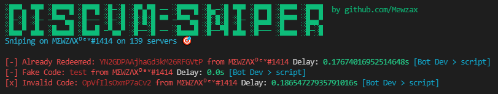

<h1 align="center">NitroSniperPy</h1>

<p align="center">
🔫 A nitro sniper made for educational purposes only

</p>


# Features
- Snipe codes in all servers and dms of your account
- Notif by a webhook

# Requirements
- [Python](https://www.python.org/downloads/)
- [Discord-Token](https://github.com/Tyrrrz/DiscordChatExporter/wiki/Obtaining-Token-and-Channel-IDs#how-to-get-a-user-token)
- [Discord-Webhook](https://www.integromat.com/en/blog/guide-to-discord-webhooks)

# Installation
```
git clone https://github.com/Mewzax/NitroSniperPy
cd NitroSniperPy
pip install -r requirements.txt
```
or you can just download in the page and run ```install.bat``` then ```run.bat```

# About the repo
This sniper is very slow, when I say it's for educational purposes, it is really, it's just a script I made for training

# Support me
```
Join my Discord: https://discord.gg/3sNjV5GJat
Paypal: https://paypal.me/mewdev
Ko-Fi: https://ko-fi.com/mewdev
```